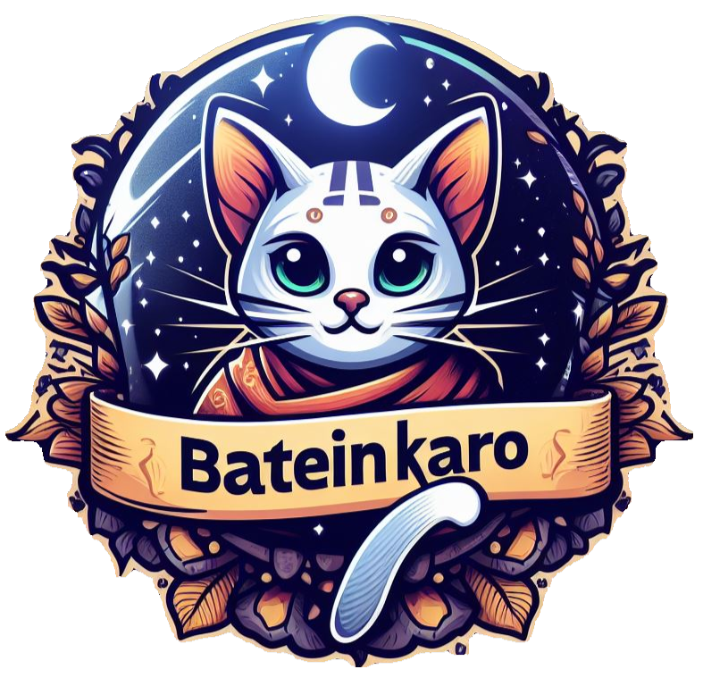

  

<h1 align="center">Batein Karo</h1>

---

<h3 align="center">  A Flutter Chat App with Firebase Integration
     
</h3>

## 📝 Table of Contents

- [About](#about)
- [Screenshots](#screenshots)
- [Key Features](#features)
- [Getting Started](#getting_started)
- [Project Strcture](#projectstructure)
- [Future Enhancements](#enhancements)
- [Inspiration and Attribution](#attribution)

## 🧐 About 

Batein Karo is a feature-rich, multi-platform chat application built with Flutter and Firebase. It empowers users to seamlessly connect and communicate across devices. With a focus on user experience and scalability, Batein Karo offers a solid foundation for further development.

## 📸 Screenshots 
|                ||     |
|----------------|-------------------------------|-----------------------------|
||         |        |
||        |   

## ✨ Key Features 

- **Messaging:**
  - Send and receive text messages to individuals with the ability to edit sent messages for flexibility.
  - View message statuses (seen/unseen) for better communication flow.
  - Solo heart emojis that animate with a beating effect, similar to WhatsApp, adding a fun and engaging touch to conversations.
- **Media Sharing:**
  - Share and receive images, enhancing chat interactions.
  - Download or save received images for offline viewing.
- **Cloud Storage:**
  - Securely store data in the Firebase cloud, ensuring reliability and accessibility.
- **User Management:**
  - Create a profile, set a personalized profile picture, and add an "About Me" section.
  - View other users' profile pictures, online status, last seen, and "About Me" sections.
  - Forgot Password feature allowing users to easily reset their passwords and regain access to their accounts.
- **Notifications:**
  - Receive timely notifications even when the app is in the background, ensuring you never miss a message.
- **Export Feature:**
  - Export entire chat conversations, including images and user profiles.
- **Delete Functionality:**
  - Delete unwanted messages.
- **Material 3 UI:**
  - Experience a modern and visually appealing interface that adheres to Material 3 design principles.
- **Additional Features:**
  - Launcher screen and custom icon for a polished user experience.
  - Photo viewer for profile pictures and sent images with zooming capabilities for detailed viewing.
  - Essential chat app functionalities for smooth communication.

## 🏁 Getting Started 

To get started quickly and easily, follow these steps:
**Prerequisites:**

- **Flutter 3.2.4:** Ensure you have Flutter version 3.2.4 or later installed on your system. Refer to the official Flutter documentation for detailed installation instructions:  [https://docs.flutter.dev/get-started/install](https://docs.flutter.dev/get-started/install)
- **Firebase Project:** Head to the Firebase console ([https://console.firebase.google.com/](https://console.firebase.google.com/)) and create a new project. This will power your chat app's data storage and communication.

**Setting Up Firebase:**

1. **Enable Firebase Services:** Within your newly created Firebase project, activate the services you'll be using in the Batein Karo app. Some common choices include Authentication (for user login), Firestore (for storing chat data), and Storage (for media sharing). Refer to the Firebase documentation for guidance on enabling these services:  [https://firebase.google.com/pricing](https://firebase.google.com/pricing)

2. **Connect Firebase to Flutter:**
    - Refer to the this documentation for details regarding the below mentioned points:  [https://firebase.google.com/docs/flutter/setup?platform=android](https://firebase.flutter.dev/docs/overview)
    - **Firebase CLI:** Install the Firebase CLI globally using your preferred package manager (e.g., npm or yarn). This tool helps manage your Firebase project from the command line. Refer to the official documentation for installation instructions:  [https://firebase.google.com/docs/cli](https://firebase.google.com/docs/cli).
    - **FlutterFire CLI:** While the Firebase CLI sets up the overall project connection, FlutterFire CLI is a plugin specifically designed for integrating Firebase features within your Flutter app. Use the `flutterfire configure` command to configure FlutterFire for your chosen platforms (Android, iOS, etc.).

**Installing Dependencies:**

- Carefully review the `pubspec.yaml` file within the Batein Karo project. This file lists all the external libraries (packages) required for the app to function.
- Run the command `flutter pub get` in your terminal to download and install these dependencies.  **Important:** Pay close attention to any compatibility notes or additional setup instructions mentioned on the pub.dev pages of these libraries, especially for specific platforms (Android, iOS, etc.). You might encounter issues if these platform-specific requirements aren't met.

**Connecting a Device or Emulator:**

Follow Flutter's official documentation to connect a physical device or launch an emulator ([invalid URL removed]). Ensure a compatible device/emulator is ready to receive the app.

**Running the App:**

1. Open your terminal or command prompt and navigate to the root directory of the Batein Karo project.
2. Run the command `flutter run` to launch the app on your connected device or emulator.

**Understanding Your Data (Firestore Schema):**

The included [`FirestoreChatAppSchema.pdf`](FirestoreChatAppSchema.pdf) document outlines how your chat data is organized and stored in the cloud. This schema is crucial for comprehending how messages, users, and other chat-related information are structured. You may need to manually set up collections and documents in Firestore according to this schema if they are not automatically created.

## 🗂️ Project Strcture 

The Batein Karo codebase is organized using a clear and modular structure:

- `lib/`:
  - `functions/`: Helper functions for various app functionalities (authentication, API calls, etc.).
  - `models/`: Dart classes representing your chat app's data models (user, message, etc.).
  - `screens/`: Individual screens that make up the app's UI (chat screen, profile screen, etc.).
  - `widgets/`: Reusable UI components or parts of the screen broken down in different widgets.

## 🚀 Future Enhancements 

Batein Karo serves as a solid foundation for a feature-rich chat application. Here are some potential areas for future development:

- **Group Chats:** Implement functionality for creating and managing group chats, allowing users to communicate with multiple individuals.
- **Search Functionality:** Integrate a search bar to enable users to quickly search for specific messages, contacts, or content within the app.
- **State Management:** Consider incorporating a state management solution like Provider, Riverpod, or Bloc to manage complex app state and improve code organization.
- **Additional Features:** Explore adding features like voice messages, video calls, location sharing, and more to enhance user experience.

## 🙏 Inspiration and Attribution 

- **Project Origin:** This project began as the final project for the Udemy course "Flutter & Dart - The Complete Guide [2024 Edition]" ([https://www.udemy.com/course/learn-flutter-dart-to-build-ios-android-apps/](https://www.udemy.com/course/learn-flutter-dart-to-build-ios-android-apps/)). This course provided a solid foundation in Flutter development concepts and practical application.

- **Further Inspiration from Harsh H. Rajpurohit:** Beyond the core curriculum, the project also draws inspiration from the extensive content available on Harsh H. Rajpurohit's YouTube channel ([https://www.youtube.com/@harshRajpurohit](https://www.youtube.com/@harshRajpurohit)).

## 📌 PS 

**Pssst! That awesome image at the top?** It's kind of like a cool hat for this README – there to add a little pizazz, but not exactly what the app looks like. Just imagine a boring simple with little fun app under there, waiting to be explored! (I made that image with AI help, just for fun.)

**Want to chat more?** I'd love to hear your thoughts on this project or anything Flutter-related! Feel free to connect with me on Linkedin: [Sanskar Vijpuria](https://www.linkedin.com/in/sanskarvijpuria/)
